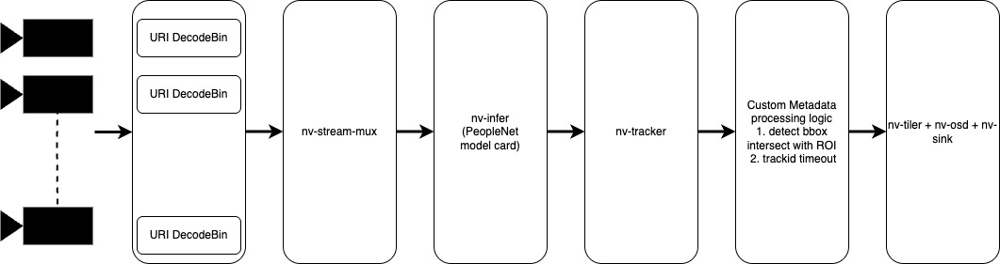

# DeepStream People Detection and ROI Monitoring

This project implements a DeepStream pipeline for monitoring people in multiple camera streams and detecting when they remain in specified regions of interest (ROIs) for extended periods (loitering alerts).

## Features

- Support video and rtsp streams
- PeopleNet-based person detection
- Person tracking using nvDCF tracker
- Configurable Regions of Interest (ROIs) with a timeout for loitering alerts
- Visual alerts when people remain in ROIs beyond a n seconds
- Multi-camera grid display
- Real-time visualization with bounding boxes and tracking IDs

## Pipeline




## Prerequisites

- Deepstream setup with dGPU or Jeton device
- DeepStream SDK 6.2 or later
- Coresponding DeepStream Python bindings

## Usage

1. Clone this repository:
   ```bash
   git clone https://github.com/chinthysl/deepstream-python.git
   cd deepstream-python
   ```

2. Run the pipeline:
   ```bash
   python3 test.py <videofile> <roi x> <roi y> <roi width> <roi height> <timeout in sec>
   python3 test.py sample_1080p_h264.mp4 10 400 500 400 2
   ```

## Future development

- Enable multiple streams
- Dynamic addition of streams
- RTSP server activation or video recoding when loitering detected
- Deployment optimizations of edge devices to cater more video streams
- API and alert based control of the pipeline

## Test

Pipeline was tested on Jetson AGX Xavier. Screen recording of the test in output.webm

## License

This project is licensed under the MIT License - see the LICENSE file for details. 